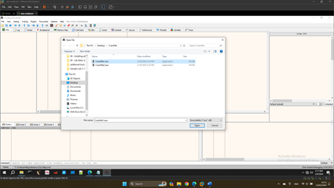
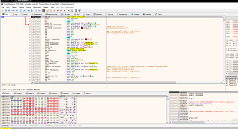
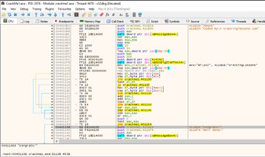
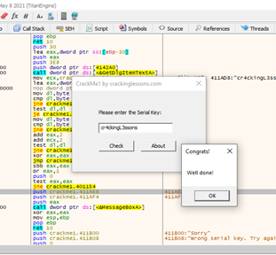

CrackMe 1
Mở CrackMe1.exe bằng x32dbg

Sau khi chạy CrackMe1.exe thì được như dưới
 
Search String References và tìm đến vị trí “Congrats!”. Có 1 tham chiếu GetDIgItemTextA để lấy item từ text nhập pass.
Dòng 00401139 có 1 conditional jump, dựa theo dòng test eax ở trên để so sánh với “cr4ckingL3ssons”, nếu eax = 0 thì dòng congrats được hiển thị, ngược lại sẽ nhảy đến thông báo sai. Như vậy pass là cr4ckingL3ssons.

   

