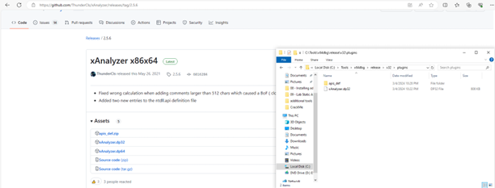
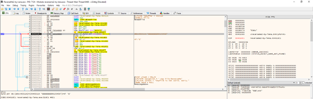

**CrackMe 10**

- Đầu tiên cần tải và copy plugins xAnalyzer vào folder plugins như dưới:

 
- Thực hiện phân tích bằng xAnalyzer vừa cài, thấy file Keyfile.dat đang được đọc 
 

nhưng giá trị eax sau lệnh CreateFileA là FFFFFFFF (là 1 số âm), tức là không tìm thấy file. Việc ta cần làm là tạo 1 Keyfile.dat

 
- Dòng 004010B8 có lệnh so sánh ở ô 402173 với 0x10 (là 16), như vậy key có 16 kí tự. Tiếp theo có 1 vòng lặp cho đến khi thấy sign 0, tức là phần cuối của file. Vòng lặp này đếm số lần kí tự G xuất hiện vào biến đếm esi. Sau đó nó có lệnh cmp esi, 8, tức là nếu esi < 8 thì nó sẽ nhảy đến not valid. Điều này cho thấy key phải có 8 kí tự G và dài 16 kí tự. Ta hãy cho 1 pass vào file .dat ở trên, ví dụ GGGGGGGG90123456 ( đủ 16 kí tự và 8 chữ G):

 
- Sau khi hoàn thành tạo 1 key “GGGGGGGG90123456” vào file .dat:
 

