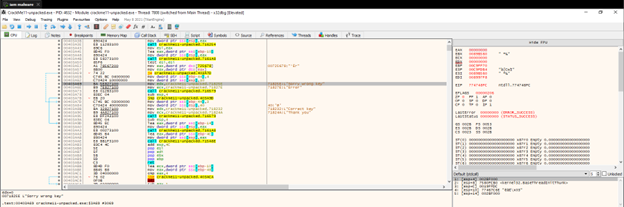
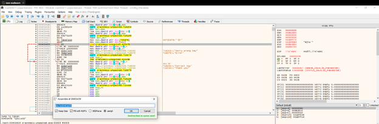
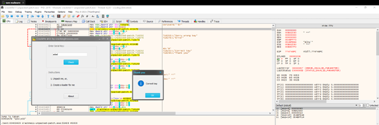

**CrackMe 11**

- Sử dụng Search for String và tìm đến thông báo “Sorry Wrong Key”

 
- Ta  thấy ở đây có 1 lệnh je (jump is not taken) để skip thông báo này ta cần sử je thành jne (jump is taken) để pass thông báo “Sorry Wrong Key”

 
- Sau khi patch fle và chạy thử
 

