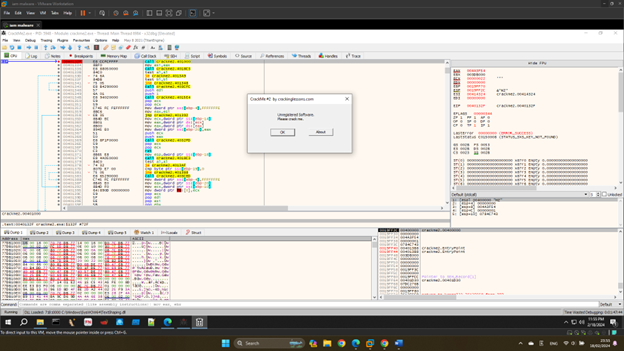
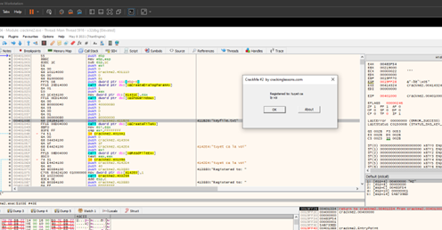

**CrackMe 3**

- Đến vị trí có thông báo đầu tiên để tắt nó

- Ở dòng 00401029 có 1 lệnh jump dựa theo việc so sánh ở dòng 0040101D để hiện messagebox ở dòng 00401039.
Ta chỉ cần sửa jne thành je để bypass box đầu.

 
- Sau khi đổi thì sẽ bỏ qua thông báo đầu tiên như dưới

- Mở file vừa patch để tiếp tục loại bỏ bước tiếp

- Tìm đến vị trí giữa MessageBoxA và PostQuitMessage (là vùng để hiện dialog 2), ta cần jump đến vị trí đó, và ta cần tự tạo lệnh jump command(do không có sẵn). Ta cần sửa dòng 0040110D thành push 0x401121

 
patch file và ta đã pass được box 2.

  
- Tìm đến vị trí hiện REGISTERED ta thấy dòng 004010D8 có lệnh je dựa trên lệnh compare eax ngay trên. Ta sửa thành jne để nó không jump xuống dòng unregistered.
 

