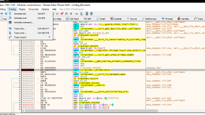
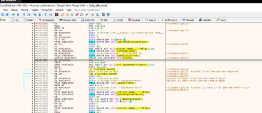
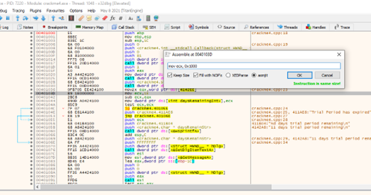
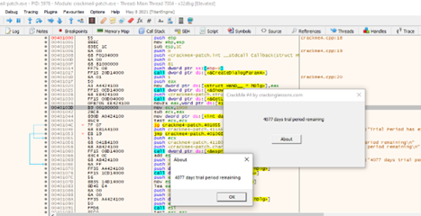

**CrackMe 4**

- Run và tìm đến dòng 00401305

 
- Dòng 00401056 lấy giá trị ngày từ ecx, ecx được nạp vào từ dòng 0040103D, trừ với ngày hiện tại ở dòng 00401042 (eax lấy từ GetLocalTime, sau lệnh CreateDialogProgramA) và thực hiện test ngay sau đó.
Ở dòng 0040103D, ta chỉ cần sửa 1E thành 1 giá trị lớn bất kì, ví dụ 1000.

 
- Sau khi patchfile chạy thử:
 

