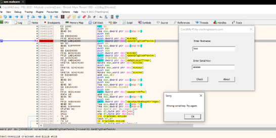
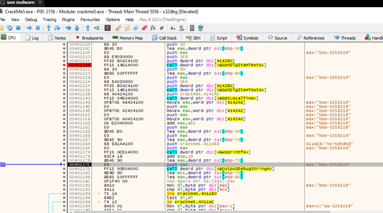
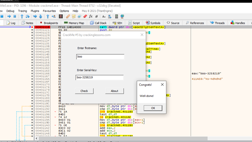

**CrackMe 5**

- Run và tìm đến vị trí hàm GetDlgItemTextA

 
- Từ vị trí hàm GetDlgItemTextA ta nhấn f8 để step over các dòng tiếp theo.

 
- Sau khi step over đến dòng 0040116A, ta thấy chuỗi %s-%d…, đó là định dạng chuỗi – số, đây có thể là chỗ để generate key. Chạy them vài bước nữa, key sẽ được tạo ra, đó là sự kết hợp của tên người dung và chuỗi - số cố định, là “boo – 3258219”. Đây là serialkey mà chúng ta cần tìm.
 

