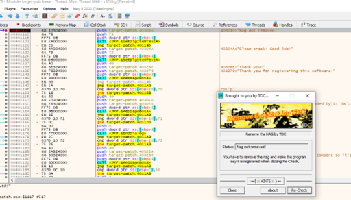

**CrackMe 6**

- Tìm đến thông báo đầu tiên để tìm cách loại bỏ nó
 

 
- Có 1 lệnh jump nhảy đến do chưa registered và hiện các thông báo register như trên. Do đó ta fill with nop từ dòng 004010A7 đến 004010BA (để không hiển thị dialog nữa):

 
- Để thay đổi trạng thái khi ấn re-check, ta cần tìm đoạn not registered và breakpoint nó lại.

 
- Khi chạy đến breakpoint 1, ấn re-check sẽ nhảy sang breakpoint 2:

 

- Ta đặt breakpoint ở lệnh je. Nhận thấy là nó sẽ nhảy vào thông báo Nag not removed, và ZF cần được đổi sang 0:

 
- Nhưng đến đây nó lại đi vào 1 lệnh jump khác, và “jump is not taken” cho thấy nó sẽ không nhảy đến đó, vì thế cần phải cho phép jumpo bằng cách đổi ZF thành 1

 
- Patchfile và chạy lại thì khi đó đã thay đổi được thông báo
 

