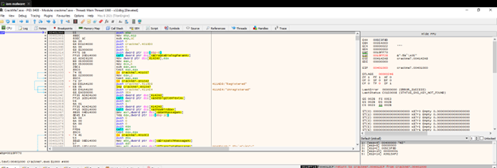
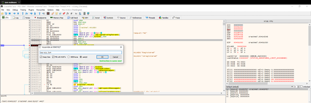
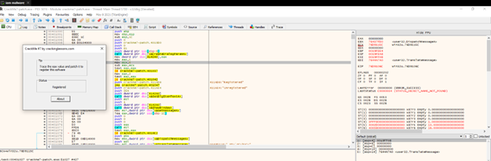

**CrackMe 7**

- Đầu tiên tìm đến vị trí hiện thị thông báo Unregistered để đổi nó thành Registered

 
- Ở bài lab này ta cần để ý đến giá trị eax. Ta nhận thấy cả eax và ecx đều nhận là 5, và khi trừ đi (lệnh sub) thì eax = 0, dẫn đến kết quả phép test eax, eax là đúng và dẫn đến dòng unregistered. Do đó, phải cho eax và ecx khác nhau bằng cách sửa 1 trong 2, ví dụ sửa ecx thành 4:

 
- Sau khi đổi thì ta được như hình
 

