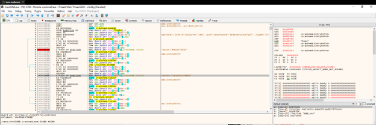
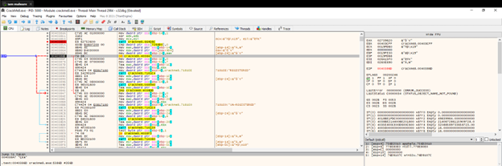
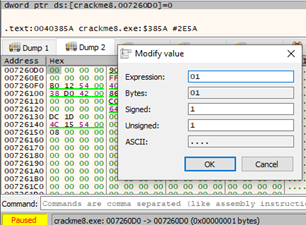

**CrackMe 8**

- Tìm đến vị trí Un-Registered bằng Search For String

 
- Ta thấy ở dòng 0040386D có 1 lệnh je, do vậy nó sẽ jump và hiện thị Un-REGISTERED

 
- Việc ta cần làm ở đây đó là ngăn chặn điều này xảy ra. Ta thấy lệnh jump ở trên dựa trên lệnh compare giá trị dòng 7260D0 và 0, nếu bằng nhau thì ZF = 1 và lệnh nhảy thực hiện. Để ngăn chặn thì ta cần thay đổi giá trị 7260D0 thành 1 số khác 0: 
Khi đó ta sẽ thành công REGISTERED
   

