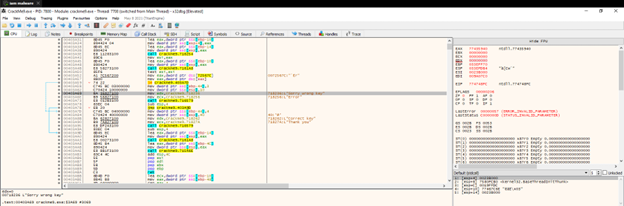
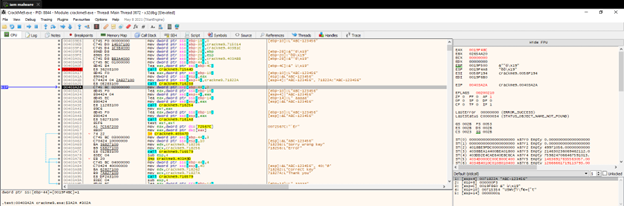
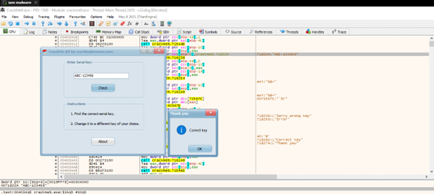
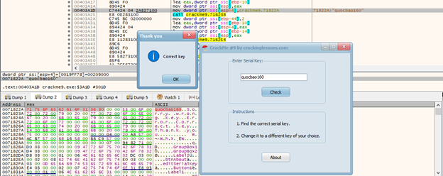

**CrackMe 9**

- Sử dụng Search for string tìm đến vị trí có thông báo “Sorry wrong key”

 
- Đặt breakpoint tại vị trí như hình và Run lại, sử dụng F8 để kiểm tra những dòng tiếp theo thì liên tục thấy 2 chuỗi “aaa” và “ABC-123456”  nhận thấy “aaa” là dòng key ta nhập bị sai,  thì có khả năng dòng “ABC-123456” là key đúng 

- Khi ta thử “ABC-123456” thì đúng và hiển thị Correct key

- Nếu muốn đổi key theo mong muốn của mình thì thay đổi data của address 71822A
 

